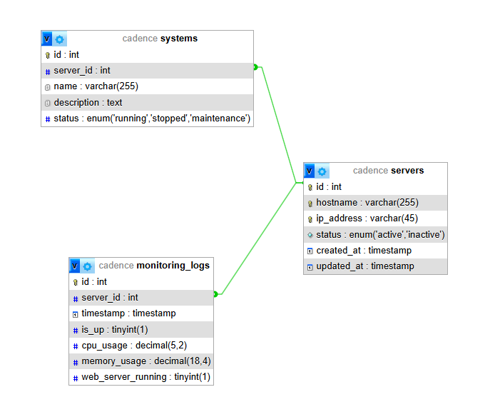

# 🖥️ Monitoring System

Este é um sistema de monitoramento de servidores web **on-premises**, desenvolvido utilizando **PHP** e **MySQL**.  
Ele permite gerenciar informações dos servidores, associar sistemas hospedados e monitorar o status dos servidores, consumo de CPU e memória.

## 📌 Funcionalidades

- 📡 Cadastro e listagem de servidores e sistemas hospedados  
- 📊 Monitoramento de servidores (status, uso de CPU/memória, processos do servidor web)  
- 🔄 Atualização automática do status dos servidores  
- 📋 Interface web para visualização dos dados  

---

## 🛠️ Tecnologias Utilizadas

- **Backend:** PHP 8.2 + MySQL  
- **Frontend:** HTML, CSS, JavaScript
- **Banco de Dados:** MySQL  

---

## 🚀 Como Rodar o Projeto

1 - Clone o repositório

```bash
    git clone https://github.com/seuusuario/monitoring-system.git
    cd monitoring-system
```

2 - Execute o Docker Compose
Para rodar o ambiente, basta executar:

```bash
    cd db-setup-docker/
    docker compose up -d
```

3 - Na raiz do projeto, execute o comando abaixo:

```bash
    php -S Localhost:8000
```

4 - Acesse no navegador para visualizar o frontend

```bash
    http://localhost:8000/index.php
```

5 - O script php que vai rodar no Task Schedule do servidor está no caminho abaixo

```bash
    server/script.php
```

6 - Parar os containers
Se precisar parar a execução do container com o banco de dados:

```bash
    docker compose down
```


## Detalhamento

### PART 1: Web Development & Automation 

1.a - Criei três tabelas: systems, servers e monitoring_logs, cada uma contendo os campos conforme o modelo entidade-relacionamento abaixo.

Modelo Entidade-Relacionamento (ER)



1.b - Implementação da Aplicação
A implementação pode ser acessada neste repositório. A página inicial está localizada em
    
```bash
    src/index.php
```
    
A aplicação consiste em um formulário simples para cadastro dos servidores e suas principais informações, além do cadastro dos sistemas associados.
Isso permite uma visão clara do impacto em caso de problemas no servidor.
Os dados de CPU e memória são atualizados por meio do script (server/script.php) que, via task schedule, alimenta periodicamente o banco de dados e atualiza as informações exibidas na tela.

1.c - Monitoramento dos Servidores

Para monitorar os servidores, criei um script separado que deve ser executado via task schedule (por exemplo, a cada 5 ou 10 minutos).
Esta configuração pode variar conforme o sistema operacional utilizado.

A arquitetura da aplicação foi desenhada para ser simples e de fácil manutenção. Cada servidor possui uma instância do arquivo server.php, configurada para ser executada em cron jobs, que alimenta um banco de dados compartilhado. Esses dados são posteriormente consumidos por uma aplicação PHP (backend) e apresentados via frontend.


Nessa arquitetura, cada servidor vai ter o seu arquivo do projeto com o server.php que vai estar configurado em um cron job e vai executar de tempos em tempos e alimentar o meu banco de dados compartilhado entre os servidores.
Esses dados armazenados serão consumidos por uma aplicação PHP backend e depois apresentada pelo frontend da própria aplicação, algo bem simples e funcional.


2 - Plano de Migração

Para um plano de migração eficaz, minha abordagem envolve:

Criar uma cópia do ambiente a ser migrado e realizar testes de atualização dos serviços por um período de 2 a 3 dias em ambiente controlado.
Migrar serviço a serviço, executando testes de cada aplicação migrada.

Implementar um ambiente de "produção assistida", onde o novo servidor recebe parte da carga do ambiente antigo por cerca de 7 dias, possibilitando monitorar a performance e identificar possíveis problemas.

Após validar a estabilidade, realizar uma migração gradual com auxílio de um balanceador de carga até que a totalidade da carga seja direcionada para o novo ambiente.
Essa abordagem minimiza o tempo de inatividade e os impactos para o usuário, embora a configuração do balanceador de carga seja um desafio que requer atenção.

3 - Automação de Tarefas

Para decidir pela automação de tarefas, considero os seguintes fatores:

    - Criticidade e Complexidade: Avaliação da sensibilidade da tarefa e os problemas ocorridos com execuções manuais.
    - Retorno da Automação: Benefícios como economia de tempo e otimização de recursos.
    - Frequência da Tarefa: Quantidade e intervalo de execuções.
    - Recursos e Ferramentas Disponíveis: Disponibilidade de ferramentas e mão de obra para implementar a automação.
    
Costumo realizar pelo menos 5 execuções manuais antes de automatizar uma tarefa, o que ajuda a identificar e corrigir possíveis erros, garantindo maior confiabilidade na automação.


### PART 2: Python

4.a - Execução dos Scripts

O código referente a este módulo encontra-se na pasta "python".
Para executar o arquivo de validação, utilize:
    
```bash
    cd python
    python validate_license_plate.py
```

Para executar o arquivo de teste de validação, utilize:

```bash
    cd python
    python test_validate_license_plate.py
```

4.b - Criação da Interface

Caso seja necessário desenvolver uma interface, a escolha da biblioteca dependerá da plataforma alvo.
Para aplicações web, pode-se criar uma interface responsiva e flexível, que, se necessário, pode ser adaptada para um PWA (Progressive Web App), oferecendo uma versão "instalável" da solução.
Para aplicações desktop, a escolha seria direcionada a bibliotecas específicas para esse ambiente.


### PART 3: Quality Assurance


5 - Análise de Problemas

Para investigar eventuais problemas, a primeira ação é verificar se houve atualizações nos módulos ou nos servidores, principalmente se uma nova versão foi lançada no mesmo período em que a degradação começou.
Também é importante:

    - Analisar os módulos separadamente para identificar se o problema está restrito a um módulo específico.
    - Comparar o desempenho com períodos anteriores para detectar possíveis padrões de aumento de carga ou processos críticos.
    - Verificar informações dos servidores e utilizar ferramentas similares ao proposto pelo teste para monitorar a situação.
    - Inspecionar o banco de dados quanto a processos travados ou tabelas lockadas, além de analisar os logs dos módulos para identificar erros ou exceções.


